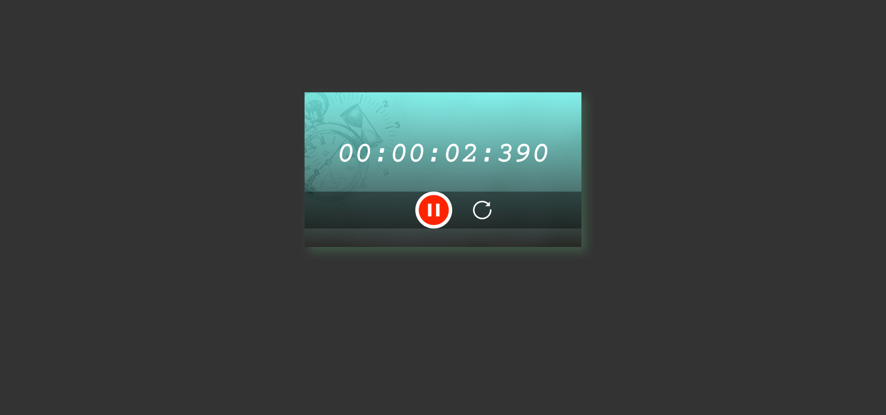

# Stopwatch Project

## Overview

This Stopwatch project is a simple, user-friendly web application built using HTML5, CSS3, and JavaScript. It provides a functional stopwatch that allows users to start, pause, and reset the timer.

## Screenshot




## Features

- **Start and Pause**: Users can start and pause the stopwatch using a clickable button.
- **Reset**: Users can reset the stopwatch to zero.
- **Formatted Time Display**: The stopwatch displays the time in hours, minutes, seconds, and milliseconds.

## Technologies Used

- **HTML5**: For the structure and layout of the application.
- **CSS3**: For styling the application, including a responsive design.
- **JavaScript**: For implementing the stopwatch functionality.

## Installation

1. Clone the repository or download the ZIP file.
2. Open the `index.html` file in your preferred web browser.

## File Structure

```plaintext
├── images
│   ├── start.png      # Image for start button
│   ├── pause.png      # Image for pause button
│   └── reset.png      # Image for reset button
├── style.css          # Stylesheet for the stopwatch UI
├── script.js          # JavaScript file for stopwatch logic
├── index.html         # HTML file containing the structure of the stopwatch
└── README.md          # This file

## Usage

1. **Starting the Stopwatch**: Click on the "Start" button to begin timing. The button will change to "Pause".
2. **Pausing the Stopwatch**: Click on the "Pause" button to halt the timer.
3. **Resetting the Stopwatch**: Click on the "Reset" button to stop the timer and set the time back to zero.
